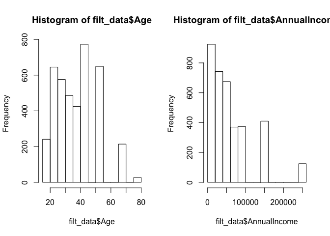

# Introduction
***

Some info about high-level project info and goals

# Data Sources
***

Two primary raw data sources, discussed below.

### Procrastionation Data

Qualtrics data, very rough around the edges, various assumptions made. See codebook for
details of all columns.

### Human Development Index Data

Human Development Index maintained by UN, blah blah some info from Wikipedia. Link to source.
Explanation of which tables. Link to codebook for columns.

# Data Importing & Merging
***

The below codechunk sources the data cleaning script for our procrastination data. There is a 
commented out write.csv statement if source data is updated and you want to get local
clean copies of the new source data

```r
source("analysis/ProcrastinationData-ImportAndTidying.R")
#write.csv()
knitr::kable(procrastination_dims,"html",row.names=FALSE) %>%
  kableExtra::kable_styling(bootstrap_options = c("striped","condensed"), 
                            full_width=F, 
                            position="left")
```

<table class="table table-striped table-condensed" style="width: auto !important; ">
<thead><tr>
<th style="text-align:right;"> Number of Rows </th>
   <th style="text-align:right;"> Number of Columns </th>
  </tr></thead>
<tbody><tr>
<td style="text-align:right;"> 4264 </td>
   <td style="text-align:right;"> 61 </td>
  </tr></tbody>
</table>

The below codechunk sources the wikipedia scraping script for HDI data. There is a 
commented out write.csv statement if source data is updated and you want to get local
clean copies of the new source data

```r
source("data/hdi-wiki-scrape.R")
# write.csv(hdi_clean, file = "data/hdi_table.csv", row.names = FALSE)
```


The below codechunk merges the two datasets and saves a copy to the /data directory.
The saving step has been commented out, remove the # sign if data is updated and a new
copy of the clean and merged data is required.

```r
all_data <- merge(
  final_procras,
  hdi_clean,
  by.x = "CntryOfRes",
  by.y = "Country",
  all.x = TRUE
)
# write.csv()
```

# Preliminary Analysis
***

Below we source our preliminary analysis script.

```r
source("analysis/q4-analysis.R")

# Print display friendly table of summary statistics for key variables
knitr::kable(summary_list, 
             col.names = c("Variable", "Min Value", "1st Quartile",
                           "Median", "Mean", "3rd Quartile", 
                           "Max Value", "Missing Count"), 
             digits = 2, 
             format = "html",
             format.args = list(scientific = FALSE)) %>%
  kableExtra::kable_styling(bootstrap_options = c("striped","condensed"), 
                            full_width=F, 
                            position="left")
```

<table class="table table-striped table-condensed" style="width: auto !important; ">
<thead><tr>
<th style="text-align:left;"> Variable </th>
   <th style="text-align:right;"> Min Value </th>
   <th style="text-align:right;"> 1st Quartile </th>
   <th style="text-align:right;"> Median </th>
   <th style="text-align:right;"> Mean </th>
   <th style="text-align:right;"> 3rd Quartile </th>
   <th style="text-align:right;"> Max Value </th>
   <th style="text-align:right;"> Missing Count </th>
  </tr></thead>
<tbody>
<tr>
<td style="text-align:left;"> Age </td>
   <td style="text-align:right;"> 19.00 </td>
   <td style="text-align:right;"> 28.00 </td>
   <td style="text-align:right;"> 37.50 </td>
   <td style="text-align:right;"> 38.28 </td>
   <td style="text-align:right;"> 45.00 </td>
   <td style="text-align:right;"> 80.00 </td>
   <td style="text-align:right;"> NA </td>
  </tr>
<tr>
<td style="text-align:left;"> AnnualIncome </td>
   <td style="text-align:right;"> 10000.00 </td>
   <td style="text-align:right;"> 15000.00 </td>
   <td style="text-align:right;"> 45000.00 </td>
   <td style="text-align:right;"> 59879.87 </td>
   <td style="text-align:right;"> 87500.00 </td>
   <td style="text-align:right;"> 250000.00 </td>
   <td style="text-align:right;"> 415 </td>
  </tr>
<tr>
<td style="text-align:left;"> HDI </td>
   <td style="text-align:right;"> 0.48 </td>
   <td style="text-align:right;"> 0.92 </td>
   <td style="text-align:right;"> 0.92 </td>
   <td style="text-align:right;"> 0.91 </td>
   <td style="text-align:right;"> 0.92 </td>
   <td style="text-align:right;"> 0.95 </td>
   <td style="text-align:right;"> 173 </td>
  </tr>
<tr>
<td style="text-align:left;"> DPMean </td>
   <td style="text-align:right;"> 1.00 </td>
   <td style="text-align:right;"> 2.40 </td>
   <td style="text-align:right;"> 3.00 </td>
   <td style="text-align:right;"> 3.05 </td>
   <td style="text-align:right;"> 3.80 </td>
   <td style="text-align:right;"> 5.00 </td>
   <td style="text-align:right;"> NA </td>
  </tr>
<tr>
<td style="text-align:left;"> AIPMean </td>
   <td style="text-align:right;"> 1.00 </td>
   <td style="text-align:right;"> 2.40 </td>
   <td style="text-align:right;"> 2.93 </td>
   <td style="text-align:right;"> 2.96 </td>
   <td style="text-align:right;"> 3.53 </td>
   <td style="text-align:right;"> 5.00 </td>
   <td style="text-align:right;"> NA </td>
  </tr>
<tr>
<td style="text-align:left;"> GPMean </td>
   <td style="text-align:right;"> 1.00 </td>
   <td style="text-align:right;"> 2.80 </td>
   <td style="text-align:right;"> 3.25 </td>
   <td style="text-align:right;"> 3.24 </td>
   <td style="text-align:right;"> 3.75 </td>
   <td style="text-align:right;"> 5.00 </td>
   <td style="text-align:right;"> NA </td>
  </tr>
<tr>
<td style="text-align:left;"> SWLSMean </td>
   <td style="text-align:right;"> 1.00 </td>
   <td style="text-align:right;"> 2.40 </td>
   <td style="text-align:right;"> 3.00 </td>
   <td style="text-align:right;"> 3.05 </td>
   <td style="text-align:right;"> 3.80 </td>
   <td style="text-align:right;"> 5.00 </td>
   <td style="text-align:right;"> NA </td>
  </tr>
</tbody>
</table>

```r
par(mfrow = c(1, 2))
hist(filt_data$Age)
hist(filt_data$AnnualIncome)
```

<!-- -->

# Deep Dive
***
