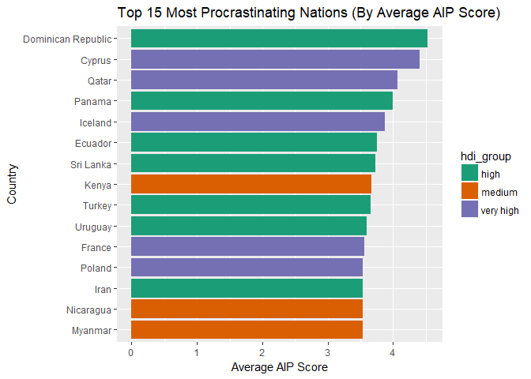
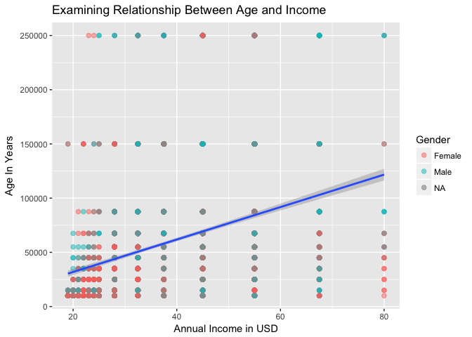

# Introduction
***

JWJK Analytics conducted the below analysis to explore and hopefully understand the relationship between procrastination and human development across the globe. This information was requested by the United Nations Development Programme to help provide insight into the factors that play into human development and life satisfaction across nations. Ideally, any insights gleaned from this analysis can help the UN implement programs for social benefit across under-served areas. 

# Data Sources
***

This analysis was conducted using two data sources. See below for details about each.

### Procrastination Survey Data

'Procrastination.csv' are the raw results of a research study, tabulated by Qualtrics. The study asked participants a series of demographic questions, as well as asked questions related to procrastination. Participants were also measured on several procrastination scales. The data from Qualtrics required extensive cleansing and organizing. 'TidyProcrastination.csv' is a cleaned up, machine-readable version of the raw data.

### Human Development Index Data

The Human Development Index (HDI) is a statistic created and distributed by the United Nations. It is a composite statistic derived using indicators for education, life expectancy, and income per capita. This score can be viewed as the potential for human development and prosperity in a given country. We access this data with an R script that scrapes the HDI Wikipedia page. See below image from Wikipedia for a high level understanding of how the HDI is calculated.

<center><p><a href="https://en.wikipedia.org/wiki/File:HDI_explained_the_best_way.png#/media/File:HDI_explained_the_best_way.png"></a><br><a href="https://creativecommons.org/licenses/by/3.0/" title="Creative Commons Attribution 3.0">CC BY 3.0</a>, <a href="https://en.wikipedia.org/w/index.php?curid=55637565">Link</a></p></center>

# Data Importing & Merging
***

The below code chunk sources the data cleaning script for our procrastination data. See the script for details of how the file was cleaned.

```r
library(knitr)
library(kableExtra)
source("data/q2-clean-procras-raw.R")
kable(procrastination_dims,"html",row.names=FALSE) %>%
  kable_styling(bootstrap_options = c("striped","condensed"), 
                full_width = FALSE)
```

<table class="table table-striped table-condensed" style="width: auto !important; margin-left: auto; margin-right: auto;">
<thead><tr>
<th style="text-align:right;"> Number of Rows </th>
   <th style="text-align:right;"> Number of Columns </th>
  </tr></thead>
<tbody><tr>
<td style="text-align:right;"> 4264 </td>
   <td style="text-align:right;"> 61 </td>
  </tr></tbody>
</table>

The below code chunk sources the Wikipedia scraping script for HDI data. This script will pick up and save any changes in the Wikipedia tables. See the script for details of how the data is scraped.

```r
source("data/q3-hdi-wiki-scrape.R")
```

The below code chunk merges the two data sets and saves a copy to the /data directory. See script for details of how data sets are merged.

```r
source("data/q3-merging-hdi-and-procrastination.R")
```

# Preliminary Analysis
***

Below we source our preliminary analysis script. See script for details of how data is summarized for the following tables and histograms.

```r
source("analysis/q4-analysis.R")
```

### Summary Statistics

To begin understanding our data, we will run some standard summary statistics for a number of key variables.


```r
# Print display friendly table of summary statistics for key variables
kable(summary_list,
      digits = 2,
      format = "html") %>%
  kable_styling(bootstrap_options = c("striped","condensed"),
                full_width = FALSE)
```

<table class="table table-striped table-condensed" style="width: auto !important; margin-left: auto; margin-right: auto;">
<thead><tr>
<th style="text-align:left;"> Variable </th>
   <th style="text-align:left;"> Missing </th>
   <th style="text-align:left;"> Complete </th>
   <th style="text-align:left;"> Total </th>
   <th style="text-align:left;"> Mean </th>
   <th style="text-align:left;"> Standard Deviation </th>
   <th style="text-align:left;"> Minimum </th>
   <th style="text-align:left;"> 25th Percentile </th>
   <th style="text-align:left;"> Median </th>
   <th style="text-align:left;"> 75th Percentile </th>
   <th style="text-align:left;"> Maximum </th>
   <th style="text-align:left;"> Distribution </th>
  </tr></thead>
<tbody>
<tr>
<td style="text-align:left;"> Age </td>
   <td style="text-align:left;"> 0 </td>
   <td style="text-align:left;"> 4,036 </td>
   <td style="text-align:left;"> 4,036 </td>
   <td style="text-align:left;"> 38.28 </td>
   <td style="text-align:left;"> 13.72 </td>
   <td style="text-align:left;"> 19 </td>
   <td style="text-align:left;"> 28 </td>
   <td style="text-align:left;"> 37.5 </td>
   <td style="text-align:left;"> 45 </td>
   <td style="text-align:left;"> 80 </td>
   <td style="text-align:left;"> ▇▇▃▆▅▁▂▁ </td>
  </tr>
<tr>
<td style="text-align:left;"> AIPMean </td>
   <td style="text-align:left;"> 0 </td>
   <td style="text-align:left;"> 4,036 </td>
   <td style="text-align:left;"> 4,036 </td>
   <td style="text-align:left;"> 2.96 </td>
   <td style="text-align:left;"> 0.8 </td>
   <td style="text-align:left;"> 1 </td>
   <td style="text-align:left;"> 2.4 </td>
   <td style="text-align:left;"> 2.93 </td>
   <td style="text-align:left;"> 3.53 </td>
   <td style="text-align:left;"> 5 </td>
   <td style="text-align:left;"> ▁▃▆▇▆▆▃▁ </td>
  </tr>
<tr>
<td style="text-align:left;"> AnnualIncome </td>
   <td style="text-align:left;"> 415 </td>
   <td style="text-align:left;"> 3,621 </td>
   <td style="text-align:left;"> 4,036 </td>
   <td style="text-align:left;"> 59,879.87 </td>
   <td style="text-align:left;"> 55,329.93 </td>
   <td style="text-align:left;"> 10,000 </td>
   <td style="text-align:left;"> 15,000 </td>
   <td style="text-align:left;"> 45,000 </td>
   <td style="text-align:left;"> 87,500 </td>
   <td style="text-align:left;"> 250,000 </td>
   <td style="text-align:left;"> ▇▅▂▁▂▁▁▁ </td>
  </tr>
<tr>
<td style="text-align:left;"> DPMean </td>
   <td style="text-align:left;"> 0 </td>
   <td style="text-align:left;"> 4,036 </td>
   <td style="text-align:left;"> 4,036 </td>
   <td style="text-align:left;"> 3.05 </td>
   <td style="text-align:left;"> 0.97 </td>
   <td style="text-align:left;"> 1 </td>
   <td style="text-align:left;"> 2.4 </td>
   <td style="text-align:left;"> 3 </td>
   <td style="text-align:left;"> 3.8 </td>
   <td style="text-align:left;"> 5 </td>
   <td style="text-align:left;"> ▂▅▅▇▅▇▂▃ </td>
  </tr>
<tr>
<td style="text-align:left;"> GPMean </td>
   <td style="text-align:left;"> 0 </td>
   <td style="text-align:left;"> 4,036 </td>
   <td style="text-align:left;"> 4,036 </td>
   <td style="text-align:left;"> 3.24 </td>
   <td style="text-align:left;"> 0.69 </td>
   <td style="text-align:left;"> 1 </td>
   <td style="text-align:left;"> 2.8 </td>
   <td style="text-align:left;"> 3.25 </td>
   <td style="text-align:left;"> 3.75 </td>
   <td style="text-align:left;"> 5 </td>
   <td style="text-align:left;"> ▁▁▃▆▇▇▃▁ </td>
  </tr>
<tr>
<td style="text-align:left;"> HDI </td>
   <td style="text-align:left;"> 173 </td>
   <td style="text-align:left;"> 3,863 </td>
   <td style="text-align:left;"> 4,036 </td>
   <td style="text-align:left;"> 0.91 </td>
   <td style="text-align:left;"> 0.056 </td>
   <td style="text-align:left;"> 0.48 </td>
   <td style="text-align:left;"> 0.92 </td>
   <td style="text-align:left;"> 0.92 </td>
   <td style="text-align:left;"> 0.92 </td>
   <td style="text-align:left;"> 0.95 </td>
   <td style="text-align:left;"> ▁▁▁▁▁▁▁▇ </td>
  </tr>
<tr>
<td style="text-align:left;"> SWLSMean </td>
   <td style="text-align:left;"> 0 </td>
   <td style="text-align:left;"> 4,036 </td>
   <td style="text-align:left;"> 4,036 </td>
   <td style="text-align:left;"> 3.05 </td>
   <td style="text-align:left;"> 0.97 </td>
   <td style="text-align:left;"> 1 </td>
   <td style="text-align:left;"> 2.4 </td>
   <td style="text-align:left;"> 3 </td>
   <td style="text-align:left;"> 3.8 </td>
   <td style="text-align:left;"> 5 </td>
   <td style="text-align:left;"> ▃▃▃▇▅▇▂▂ </td>
  </tr>
</tbody>
</table>

### Select Histograms

Below are full sized histograms for a couple of select variables.


```r
library(ggplot2)
ggplot(data = na.omit(all_data), aes(x = Age)) +
  geom_histogram(bins = 10, fill = "powderblue") +
  xlab("Participant Age") +
  ylab("Count") +
  ggtitle("Distribution of Participant's Age") +
  theme(
    plot.title = element_text(hjust = .5)
  )
```


The above distribution indicates our participant's age skews a bit to the right. The majority of our participants are in the 20-50 range although we have participants in age as high as 80.


```r
ggplot(data = na.omit(all_data), aes(x = DPMean)) +
  geom_histogram(bins = 20, fill = "powderblue") +
  xlab("Mean Decisional Procrastination Score") +
  ylab("Count") +
  ggtitle("Distribution of Participant's Mean Decisional Procrastination") +
  theme(
    plot.title = element_text(hjust = .5)
  )
```


The above distribution of mean decisional procrastination is roughly symmetric around 3. The data aren't very normal, the decrease in count as you get further from the center is too slow to be normal.

### Key Variables Frequency Tables

To continue getting acquainted with our data, lets look at frequency tables for a number of variables.

##### Gender

```r
kable(gender_freqs, format = "html", col.names = c("Gender", "Participants")) %>%
    kable_styling(bootstrap_options = c("striped","condensed"), 
                            full_width = FALSE)
```

<table class="table table-striped table-condensed" style="width: auto !important; margin-left: auto; margin-right: auto;">
<thead><tr>
<th style="text-align:left;"> Gender </th>
   <th style="text-align:right;"> Participants </th>
  </tr></thead>
<tbody>
<tr>
<td style="text-align:left;"> Female </td>
   <td style="text-align:right;"> 2309 </td>
  </tr>
<tr>
<td style="text-align:left;"> Male </td>
   <td style="text-align:right;"> 1721 </td>
  </tr>
<tr>
<td style="text-align:left;"> NA </td>
   <td style="text-align:right;"> 6 </td>
  </tr>
</tbody>
</table>

Looks like our participants tilt female, with around 57% of respondents identifying as such.

##### Work Status


```r
kable(workstatus_freqs, format = "html", col.names = c("Work Status", "Participants")) %>%
    kable_styling(bootstrap_options = c("striped","condensed"), 
                            full_width = FALSE)
```

<table class="table table-striped table-condensed" style="width: auto !important; margin-left: auto; margin-right: auto;">
<thead><tr>
<th style="text-align:left;"> Work Status </th>
   <th style="text-align:right;"> Participants </th>
  </tr></thead>
<tbody>
<tr>
<td style="text-align:left;"> full-time </td>
   <td style="text-align:right;"> 2260 </td>
  </tr>
<tr>
<td style="text-align:left;"> student </td>
   <td style="text-align:right;"> 837 </td>
  </tr>
<tr>
<td style="text-align:left;"> part-time </td>
   <td style="text-align:right;"> 465 </td>
  </tr>
<tr>
<td style="text-align:left;"> unemployed </td>
   <td style="text-align:right;"> 258 </td>
  </tr>
<tr>
<td style="text-align:left;"> retired </td>
   <td style="text-align:right;"> 174 </td>
  </tr>
<tr>
<td style="text-align:left;"> NA </td>
   <td style="text-align:right;"> 42 </td>
  </tr>
</tbody>
</table>

The majority of our participants are full-time employed.

##### Occupation


```r
kable(head(occu_freqs, 10), format = "html", col.names = c("Occupation", "Participants")) %>%
    kable_styling(bootstrap_options = c("striped","condensed"), 
                            full_width = FALSE) %>%
  add_footnote(label = "See 'data/occupation_counts.csv' for full table", notation = 'symbol')
```

<table class="table table-striped table-condensed" style="width: auto !important; margin-left: auto; margin-right: auto;">
<thead><tr>
<th style="text-align:left;"> Occupation </th>
   <th style="text-align:right;"> Participants </th>
  </tr></thead>
<tbody>
<tr>
<td style="text-align:left;"> NA </td>
   <td style="text-align:right;"> 2662 </td>
  </tr>
<tr>
<td style="text-align:left;"> Education </td>
   <td style="text-align:right;"> 155 </td>
  </tr>
<tr>
<td style="text-align:left;"> Software &amp; IT </td>
   <td style="text-align:right;"> 66 </td>
  </tr>
<tr>
<td style="text-align:left;"> Attorney </td>
   <td style="text-align:right;"> 62 </td>
  </tr>
<tr>
<td style="text-align:left;"> Writer </td>
   <td style="text-align:right;"> 45 </td>
  </tr>
<tr>
<td style="text-align:left;"> Healthcare </td>
   <td style="text-align:right;"> 36 </td>
  </tr>
<tr>
<td style="text-align:left;"> engineer </td>
   <td style="text-align:right;"> 32 </td>
  </tr>
<tr>
<td style="text-align:left;"> manager </td>
   <td style="text-align:right;"> 32 </td>
  </tr>
<tr>
<td style="text-align:left;"> Science </td>
   <td style="text-align:right;"> 29 </td>
  </tr>
<tr>
<td style="text-align:left;"> retired </td>
   <td style="text-align:right;"> 28 </td>
  </tr>
</tbody>
<tfoot>
<tr>
<td style = 'padding: 0; border:0;' colspan='100%'><sup>*</sup> See 'data/occupation_counts.csv' for full table</td>
</tr>
</tfoot>
</table>

It seems most participants did not provide an occupation, this may not be a good variable to look at too much.

##### Participants by Country


```r
kable(head(pcpts_per_country, 10), format = "html") %>%
    kable_styling(bootstrap_options = c("striped","condensed"), 
                            full_width = FALSE) %>%
  add_footnote(label = "See 'data/participants_by_country.csv' for full table", notation = 'symbol')
```

<table class="table table-striped table-condensed" style="width: auto !important; margin-left: auto; margin-right: auto;">
<thead><tr>
<th style="text-align:left;"> Country of Residence </th>
   <th style="text-align:right;"> Participants </th>
  </tr></thead>
<tbody>
<tr>
<td style="text-align:left;"> United States </td>
   <td style="text-align:right;"> 2785 </td>
  </tr>
<tr>
<td style="text-align:left;"> Canada </td>
   <td style="text-align:right;"> 243 </td>
  </tr>
<tr>
<td style="text-align:left;"> United Kingdom </td>
   <td style="text-align:right;"> 177 </td>
  </tr>
<tr>
<td style="text-align:left;"> NA </td>
   <td style="text-align:right;"> 160 </td>
  </tr>
<tr>
<td style="text-align:left;"> Australia </td>
   <td style="text-align:right;"> 99 </td>
  </tr>
<tr>
<td style="text-align:left;"> India </td>
   <td style="text-align:right;"> 78 </td>
  </tr>
<tr>
<td style="text-align:left;"> Italy </td>
   <td style="text-align:right;"> 62 </td>
  </tr>
<tr>
<td style="text-align:left;"> Germany </td>
   <td style="text-align:right;"> 36 </td>
  </tr>
<tr>
<td style="text-align:left;"> Brazil </td>
   <td style="text-align:right;"> 20 </td>
  </tr>
<tr>
<td style="text-align:left;"> Ireland </td>
   <td style="text-align:right;"> 19 </td>
  </tr>
</tbody>
<tfoot>
<tr>
<td style = 'padding: 0; border:0;' colspan='100%'><sup>*</sup> See 'data/participants_by_country.csv' for full table</td>
</tr>
</tfoot>
</table>

Our results are heavily skewed towards United States based participants, something to keep in mind for any insights taken away. For the purposes of the UN, it is likely we need to conduct the procrastination survey more with international participants.

##### Internal vs External Perception


```r
kable(matching_perception, format = "html") %>%
    kable_styling(bootstrap_options = c("striped","condensed"), 
                            full_width = FALSE)
```

<table class="table table-striped table-condensed" style="width: auto !important; margin-left: auto; margin-right: auto;">
<thead><tr>
<th style="text-align:left;"> Self Labeled </th>
   <th style="text-align:left;"> Others would Label </th>
   <th style="text-align:right;"> Observations </th>
   <th style="text-align:right;"> Total Obs </th>
  </tr></thead>
<tbody>
<tr>
<td style="text-align:left;"> No </td>
   <td style="text-align:left;"> No </td>
   <td style="text-align:right;"> 482 </td>
   <td style="text-align:right;"> 4036 </td>
  </tr>
<tr>
<td style="text-align:left;"> Yes </td>
   <td style="text-align:left;"> Yes </td>
   <td style="text-align:right;"> 2358 </td>
   <td style="text-align:right;"> 4036 </td>
  </tr>
</tbody>
</table>

Per the above frequency table, 482/4026 don't view themselves as procrastinators AND believe others' don't view them as such either. Conversely, 2358 participants said they self-identify as procrastinators AND believe others' view them the same. It seems like *quite* a few people view themselves as procrastinators.

# Deep Dive
***

### Top 15 National Procrastination Scores

##### Based on Adult Inventory of Procrastination

The below code chunk generates a bar chart of the top 15 countries by average score on Adult Inventory of Procrastination.

```r
source("analysis/q5-analysis.R")

ggplot(top15_aip_hdi,aes(x=CntryOfRes, y=CntryMeanAIP,fill=hdi_group))+
  geom_bar(aes(reorder(CntryOfRes,CntryMeanAIP)), stat="identity")+
  ggtitle("Top 15 Most Procrastinating Nations (By Average AIP Score)")+
  xlab("Country")+ylab("Average AIP Score")+
  scale_fill_brewer(palette="Dark2")+
  coord_flip()
```



##### Based on General Procrastination scale

The below code chunk generates a bar chart of the top 15 countries by average score on General Procrastination scale.

```r
ggplot(top15_gp_hdi,aes(x=CntryOfRes, y=CntryMeanGP,fill=hdi_group))+
  geom_bar(aes(reorder(CntryOfRes,CntryMeanGP)), stat="identity")+
  ggtitle("Top 15 Most Procrastinating Nations (By Average GP Score)")+
  xlab("Country")+ylab("Average GP Score")+
  scale_fill_brewer(palette="Accent")+
  coord_flip()
```


### Linear Relationships Across Variables

The below code chunk generates a scatter plot of Annual Income vs Age to infer whether a linear relationship exists.

##### Income versus Age


```r
ggplot(data = all_data, aes(x = Age, y = AnnualIncome)) +
  geom_point(size = 2, na.rm = TRUE,  alpha = 0.5, aes(color = Gender)) +
  geom_smooth(method = "lm", na.rm = TRUE) + 
  xlab("Annual Income in USD")+ylab("Age In Years")+
  ggtitle("Examining Relationship Between Age and Income")
```



```r
knitr::kable(summary(inc_vs_age.mod)$coefficients, digits = 2) %>%
    kable_styling(bootstrap_options = c("striped","condensed"), 
                            full_width = FALSE) %>%
  add_footnote("Linear Model of Annual Income vs Age")
```

               Estimate   Std. Error   t value   Pr(>|t|)
------------  ---------  -----------  --------  ---------
(Intercept)     1950.98      2592.53      0.75       0.45
Age             1496.77        63.23     23.67       0.00

__Note:__
^a^ Linear Model of Annual Income vs Age

The above plot and linear model results agree, there is a significant positive relationship between annual income and age. This isn't too surprising, older individuals tend to be more experienced and command higher incomes. That being said, the R~2~ of our linear model is quite low, indicating age alone doesn't provide a significant amount of information on someone's income. Given drastically different standards and customs from country to country, it is not surprising that individuals from different countries make very different amounts of money on average. 

##### Life Satisfaction versus Human Development Index

The below code chunk generates a plot of Mean Life Satisfaction scores vs HDI for the country of residence of the participant.

```r
ggplot(data = all_data, aes(x = HDI, y = SWLSMean, color = Gender)) +
  geom_point(size = 2, na.rm = TRUE,  alpha = 0.5) +
  xlab("Human Development Index") +
  ylab("Mean Satisfaction With Life Score") +
  ggtitle("Examining Relationship Between HDI and Satisfaction With Life")
```


# Conclusions and Next Steps
