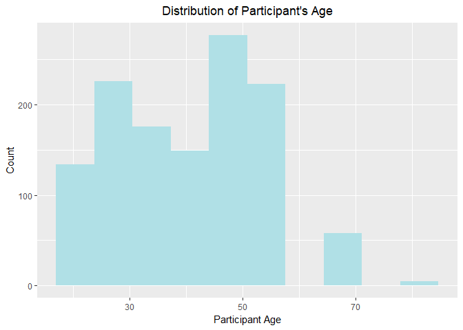
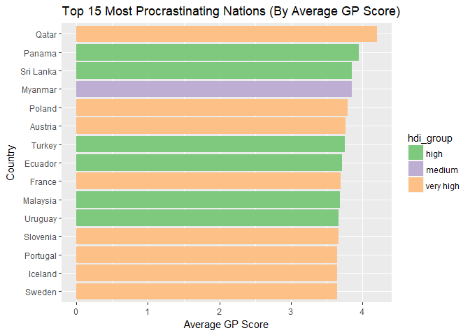

# Introduction
***

Some info about high-level project info and goals

# Data Sources
***

This analysis was conducted using two data sources. See below for details about each.

### Procrastionation Data

Qualtrics data, very rough around the edges, various assumptions made. See codebook for details of all columns.

### Human Development Index Data

The Human Development Index (HDI) is a statistic created and distributed by the United Nations. It is a composite statistic derived using indicators for education, life expectancy, and income per capita. This score can be viewed as the potential for human development and prosperity in a given country. We access this data with an R script that scrapes the HDI Wikipedia page. 

# Data Importing & Merging
***

The below code chunk sources the data cleaning script for our procrastination data. See the script for details of how the file was cleaned.

```r
library(knitr)
library(kableExtra)
source("analysis/ProcrastinationData-ImportAndTidying.R")
kable(procrastination_dims,"html",row.names=FALSE) %>%
  kable_styling(bootstrap_options = c("striped","condensed"), 
                full_width=F, 
                position="left")
```

<table class="table table-striped table-condensed" style="width: auto !important; ">
<thead><tr>
<th style="text-align:right;"> Number of Rows </th>
   <th style="text-align:right;"> Number of Columns </th>
  </tr></thead>
<tbody><tr>
<td style="text-align:right;"> 4264 </td>
   <td style="text-align:right;"> 61 </td>
  </tr></tbody>
</table>

The below code chunk sources the Wikipedia scraping script for HDI data. This script will pick up and save any changes in the Wikipedia tables. See the script for details of how the data is scraped.

```r
source("data/hdi-wiki-scrape.R")
```


The below code chunk merges the two data sets and saves a copy to the /data directory. See script for details of how data sets are merged.

```r
source("data/merging-hdi-and-procrastination.R")
```

# Preliminary Analysis
***

Below we source our preliminary analysis script. See script for details of how data is summarized for the following tables and histograms.

```r
source("analysis/q4-analysis.R")
```

### Summary Statistics


```r
# Print display friendly table of summary statistics for key variables
kable(summary_list, 
      col.names = c("Variable", "Min Value", "1st Quartile",
                    "Median", "Mean", "3rd Quartile", 
                    "Max Value", "Missing Count"), 
      digits = 2, 
      format = "html",
      format.args = list(scientific = FALSE)) %>%
  kable_styling(bootstrap_options = c("striped","condensed"), 
                full_width=F, 
                position="left")
```

<table class="table table-striped table-condensed" style="width: auto !important; ">
<thead><tr>
<th style="text-align:left;"> Variable </th>
   <th style="text-align:right;"> Min Value </th>
   <th style="text-align:right;"> 1st Quartile </th>
   <th style="text-align:right;"> Median </th>
   <th style="text-align:right;"> Mean </th>
   <th style="text-align:right;"> 3rd Quartile </th>
   <th style="text-align:right;"> Max Value </th>
   <th style="text-align:right;"> Missing Count </th>
  </tr></thead>
<tbody>
<tr>
<td style="text-align:left;"> Age </td>
   <td style="text-align:right;"> 19.00 </td>
   <td style="text-align:right;"> 28.00 </td>
   <td style="text-align:right;"> 37.50 </td>
   <td style="text-align:right;"> 38.37 </td>
   <td style="text-align:right;"> 45.00 </td>
   <td style="text-align:right;"> 80.00 </td>
   <td style="text-align:right;"> NA </td>
  </tr>
<tr>
<td style="text-align:left;"> AnnualIncome </td>
   <td style="text-align:right;"> 10000.00 </td>
   <td style="text-align:right;"> 15000.00 </td>
   <td style="text-align:right;"> 45000.00 </td>
   <td style="text-align:right;"> 59668.56 </td>
   <td style="text-align:right;"> 67500.00 </td>
   <td style="text-align:right;"> 250000.00 </td>
   <td style="text-align:right;"> 348 </td>
  </tr>
<tr>
<td style="text-align:left;"> HDI </td>
   <td style="text-align:right;"> 0.48 </td>
   <td style="text-align:right;"> 0.92 </td>
   <td style="text-align:right;"> 0.92 </td>
   <td style="text-align:right;"> 0.91 </td>
   <td style="text-align:right;"> 0.92 </td>
   <td style="text-align:right;"> 0.95 </td>
   <td style="text-align:right;"> NA </td>
  </tr>
<tr>
<td style="text-align:left;"> DPMean </td>
   <td style="text-align:right;"> 1.00 </td>
   <td style="text-align:right;"> 2.40 </td>
   <td style="text-align:right;"> 3.00 </td>
   <td style="text-align:right;"> 3.05 </td>
   <td style="text-align:right;"> 3.80 </td>
   <td style="text-align:right;"> 5.00 </td>
   <td style="text-align:right;"> NA </td>
  </tr>
<tr>
<td style="text-align:left;"> AIPMean </td>
   <td style="text-align:right;"> 1.00 </td>
   <td style="text-align:right;"> 2.40 </td>
   <td style="text-align:right;"> 2.93 </td>
   <td style="text-align:right;"> 2.97 </td>
   <td style="text-align:right;"> 3.53 </td>
   <td style="text-align:right;"> 5.00 </td>
   <td style="text-align:right;"> NA </td>
  </tr>
<tr>
<td style="text-align:left;"> GPMean </td>
   <td style="text-align:right;"> 1.00 </td>
   <td style="text-align:right;"> 2.80 </td>
   <td style="text-align:right;"> 3.25 </td>
   <td style="text-align:right;"> 3.24 </td>
   <td style="text-align:right;"> 3.75 </td>
   <td style="text-align:right;"> 5.00 </td>
   <td style="text-align:right;"> NA </td>
  </tr>
<tr>
<td style="text-align:left;"> SWLSMean </td>
   <td style="text-align:right;"> 1.00 </td>
   <td style="text-align:right;"> 2.40 </td>
   <td style="text-align:right;"> 3.00 </td>
   <td style="text-align:right;"> 3.05 </td>
   <td style="text-align:right;"> 3.80 </td>
   <td style="text-align:right;"> 5.00 </td>
   <td style="text-align:right;"> NA </td>
  </tr>
</tbody>
</table>

### Select Histograms


```r
library(ggplot2)
ggplot(data = na.omit(all_data), aes(x = Age)) +
  geom_histogram(bins = 10, fill = "powderblue") +
  xlab("Participant Age") +
  ylab("Count") +
  ggtitle("Distribution of Participant's Age") +
  theme(
    plot.title = element_text(hjust = .5)
  )
```



The above distribution indicates our participant's age skews a bit to the right. The majority of our participants are in the 20-40 range although we have participants in age as high as 80.


```r
ggplot(data = na.omit(all_data), aes(x = DPMean)) +
  geom_histogram(bins = 20, fill = "powderblue") +
  xlab("Mean Decisional Procrastination Score") +
  ylab("Count") +
  ggtitle("Distribution of Participant's Mean Decisional Procrastination") +
  theme(
    plot.title = element_text(hjust = .5)
  )
```


The above distribution of mean decisional procrastination is roughly symmetric around 3. The data aren't very normal, the decrease in count as you get further from the center is too slow to be normal.

### Key Variables Frequency Tables

##### Gender

```r
kable(gender_freqs, format = "html", col.names = c("Gender", "Participants")) %>%
    kable_styling(bootstrap_options = c("striped","condensed"), 
                            full_width=F, 
                            position="left")
```

<table class="table table-striped table-condensed" style="width: auto !important; ">
<thead><tr>
<th style="text-align:left;"> Gender </th>
   <th style="text-align:right;"> Participants </th>
  </tr></thead>
<tbody>
<tr>
<td style="text-align:left;"> Female </td>
   <td style="text-align:right;"> 2204 </td>
  </tr>
<tr>
<td style="text-align:left;"> Male </td>
   <td style="text-align:right;"> 1654 </td>
  </tr>
<tr>
<td style="text-align:left;"> NA </td>
   <td style="text-align:right;"> 5 </td>
  </tr>
</tbody>
</table>

##### Work Status


```r
kable(workstatus_freqs, format = "html", col.names = c("Work Status", "Participants")) %>%
    kable_styling(bootstrap_options = c("striped","condensed"), 
                            full_width=F, 
                            position="left")
```

<table class="table table-striped table-condensed" style="width: auto !important; ">
<thead><tr>
<th style="text-align:left;"> Work Status </th>
   <th style="text-align:right;"> Participants </th>
  </tr></thead>
<tbody>
<tr>
<td style="text-align:left;"> full-time </td>
   <td style="text-align:right;"> 2196 </td>
  </tr>
<tr>
<td style="text-align:left;"> student </td>
   <td style="text-align:right;"> 787 </td>
  </tr>
<tr>
<td style="text-align:left;"> part-time </td>
   <td style="text-align:right;"> 453 </td>
  </tr>
<tr>
<td style="text-align:left;"> unemployed </td>
   <td style="text-align:right;"> 240 </td>
  </tr>
<tr>
<td style="text-align:left;"> retired </td>
   <td style="text-align:right;"> 163 </td>
  </tr>
<tr>
<td style="text-align:left;"> NA </td>
   <td style="text-align:right;"> 24 </td>
  </tr>
</tbody>
</table>

##### Occupation


```r
kable(head(occu_freqs, 10), format = "html", col.names = c("Occupation", "Participants")) %>%
    kable_styling(bootstrap_options = c("striped","condensed"), 
                            full_width=F, 
                            position="left") %>%
  add_footnote(label = "See 'data/occupation_counts.csv' for full table", notation = 'symbol')
```

<table class="table table-striped table-condensed" style="width: auto !important; ">
<thead><tr>
<th style="text-align:left;"> Occupation </th>
   <th style="text-align:right;"> Participants </th>
  </tr></thead>
<tbody>
<tr>
<td style="text-align:left;"> NA </td>
   <td style="text-align:right;"> 2514 </td>
  </tr>
<tr>
<td style="text-align:left;"> Education </td>
   <td style="text-align:right;"> 151 </td>
  </tr>
<tr>
<td style="text-align:left;"> Software &amp; IT </td>
   <td style="text-align:right;"> 65 </td>
  </tr>
<tr>
<td style="text-align:left;"> Attorney </td>
   <td style="text-align:right;"> 62 </td>
  </tr>
<tr>
<td style="text-align:left;"> Writer </td>
   <td style="text-align:right;"> 45 </td>
  </tr>
<tr>
<td style="text-align:left;"> Healthcare </td>
   <td style="text-align:right;"> 33 </td>
  </tr>
<tr>
<td style="text-align:left;"> engineer </td>
   <td style="text-align:right;"> 31 </td>
  </tr>
<tr>
<td style="text-align:left;"> manager </td>
   <td style="text-align:right;"> 31 </td>
  </tr>
<tr>
<td style="text-align:left;"> Science </td>
   <td style="text-align:right;"> 29 </td>
  </tr>
<tr>
<td style="text-align:left;"> retired </td>
   <td style="text-align:right;"> 27 </td>
  </tr>
</tbody>
<tfoot>
<tr>
<td style = 'padding: 0; border:0;' colspan='100%'><sup>*</sup> See 'data/occupation_counts.csv' for full table</td>
</tr>
</tfoot>
</table>

##### Participants by Country


```r
kable(head(pcpts_per_country, 10), format = "html") %>%
    kable_styling(bootstrap_options = c("striped","condensed"), 
                            full_width=F, 
                            position="left") %>%
  add_footnote(label = "See 'data/participants_by_country.csv' for full table", notation = 'symbol')
```

<table class="table table-striped table-condensed" style="width: auto !important; ">
<thead><tr>
<th style="text-align:left;"> CntryOfRes </th>
   <th style="text-align:right;"> n </th>
  </tr></thead>
<tbody>
<tr>
<td style="text-align:left;"> United States </td>
   <td style="text-align:right;"> 2785 </td>
  </tr>
<tr>
<td style="text-align:left;"> Canada </td>
   <td style="text-align:right;"> 243 </td>
  </tr>
<tr>
<td style="text-align:left;"> United Kingdom </td>
   <td style="text-align:right;"> 177 </td>
  </tr>
<tr>
<td style="text-align:left;"> Australia </td>
   <td style="text-align:right;"> 99 </td>
  </tr>
<tr>
<td style="text-align:left;"> India </td>
   <td style="text-align:right;"> 78 </td>
  </tr>
<tr>
<td style="text-align:left;"> Italy </td>
   <td style="text-align:right;"> 62 </td>
  </tr>
<tr>
<td style="text-align:left;"> Germany </td>
   <td style="text-align:right;"> 36 </td>
  </tr>
<tr>
<td style="text-align:left;"> Brazil </td>
   <td style="text-align:right;"> 20 </td>
  </tr>
<tr>
<td style="text-align:left;"> Ireland </td>
   <td style="text-align:right;"> 19 </td>
  </tr>
<tr>
<td style="text-align:left;"> Israel </td>
   <td style="text-align:right;"> 19 </td>
  </tr>
</tbody>
<tfoot>
<tr>
<td style = 'padding: 0; border:0;' colspan='100%'><sup>*</sup> See 'data/participants_by_country.csv' for full table</td>
</tr>
</tfoot>
</table>

##### Internal vs External Perception


```r
kable(matching_perception, format = "html") %>%
    kable_styling(bootstrap_options = c("striped","condensed"), 
                            full_width=F, 
                            position="left")
```

<table class="table table-striped table-condensed" style="width: auto !important; ">
<thead><tr>
<th style="text-align:left;"> Self Labeled </th>
   <th style="text-align:left;"> Others would Label </th>
   <th style="text-align:right;"> Observations </th>
   <th style="text-align:right;"> Total Obs </th>
  </tr></thead>
<tbody>
<tr>
<td style="text-align:left;"> No </td>
   <td style="text-align:left;"> No </td>
   <td style="text-align:right;"> 460 </td>
   <td style="text-align:right;"> 3863 </td>
  </tr>
<tr>
<td style="text-align:left;"> Yes </td>
   <td style="text-align:left;"> Yes </td>
   <td style="text-align:right;"> 2264 </td>
   <td style="text-align:right;"> 3863 </td>
  </tr>
</tbody>
</table>

Per the above frequency table, 482/4026 don't view themselves as procrastinators AND believe others' don't view them as such either. Conversely, 2358 participants said they self-identify as procrastinators AND believe others' view them the same.

# Deep Dive
***

### Top 15 National Procrastination Scores

##### Based on Adult Inventory of Procrastination

The below code chunk generates a bar chart of the top 15 countries by average score on Adult Inventory of Procrastination.

```r
source("analysis/q5-analysis.R")

ggplot(top15_aip_hdi,aes(x=CntryOfRes, y=CntryMeanAIP,fill=hdi_group))+
  geom_bar(aes(reorder(CntryOfRes,CntryMeanAIP)), stat="identity")+
  ggtitle("Top 15 Most Procrastinating Nations (By Average AIP Score)")+
  xlab("Country")+ylab("Average AIP Score")+
  scale_fill_brewer(palette="Dark2")+
  coord_flip()
```


##### Based on General Procrastination scale

The below code chunk generates a bar chart of the top 15 countries by average score on General Procrastination scale.

```r
ggplot(top15_gp_hdi,aes(x=CntryOfRes, y=CntryMeanGP,fill=hdi_group))+
  geom_bar(aes(reorder(CntryOfRes,CntryMeanGP)), stat="identity")+
  ggtitle("Top 15 Most Procrastinating Nations (By Average GP Score)")+
  xlab("Country")+ylab("Average GP Score")+
  scale_fill_brewer(palette="Accent")+
  coord_flip()
```



### Linear Relationships Across Variables

The below code chunk generates a scatter plot of Annual Income vs Age to infer whether a linear relationship exists.
##### Income versus Age

```r
ggplot(data = all_data, aes(x=AnnualIncome, y=Age, color = Gender))+
  geom_point(size=2)+
  xlab("Annual Income in USD")+ylab("Age In Years")+
  ggtitle("Examining Relationship Between Age and Income")
```


##### Life Satisfaction versus Human Development Index

```r
ggplot(data = all_data, aes(x=HDI, y=SWLSMean, color = Gender))+
  geom_point(size=2)+
  xlab("Human Development Index")+ylab("Mean Satisfaction With Life Score")+
  ggtitle("Examining Relationship Between HDI and Satisfaction With Life")
```


